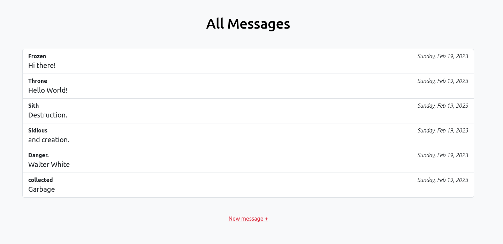

# Mini Message Board

Simple message board created with **Express**.

## Helper Dependencies

-   [EJS](https://ejs.co/) view template engine
-   [dotenv](https://www.npmjs.com/package/dotenv) for processing .env files
-   [serve-favicon](https://www.npmjs.com/package/serve-favicon) for serving favicon in servers
-   [nodemon](https://nodemon.io/) for monitoring any changes and automatically restarting server

## How It Looks

